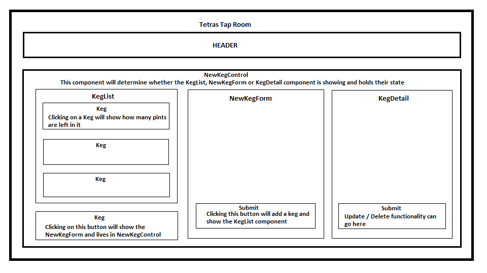

# _Tetra's Tap Room_

#### _By Alyssa Colistro, April 2020_

**Description**
_This application will allow the user (ex: a bar manager) to track the kegs of beer coming in and out of their bar and how much beer is in each keg. This is an app biult with React._

### Preview

### Component Diagram

This project was bootstrapped with [Create React App](https://github.com/facebook/create-react-app).

## _Specs_

| Behavior | Input | Output |
|----------|:-----:|--------|
| User clicks on the add keg button | 'click' | The app shows the user a form they can fill out to add a Keg |
| User fills out information for the keg they would like to add in the form and clicks 'submit' | "Corona" "1/23/20" "128" | App shows a new list that includes the newly added keg displaying the information entered in the form | 
| User clicks on a keg in the main list | 'click' | The app displays the details of that individual keg |
| The user can navigate to the main list by clicking 'back to list' button | 'click' | App displays main list of all kegs |

## User Stories

* As a user, I want to see a list/menu of all available kegs. 
* For each keg, I want to see its name, brand, price and alcoholContent.
* As a user, I want to submit a form to add a new keg to a list.
* As a user, I want to be able to click on a keg to see its detail page.
* As a user, I want to see how many pints are left in a keg. 

## Stretch Goals

* Add functionality to update pints left in keg with a 'pint sold'
* Add styling to imply that this is an Aquarium bar with Aquairum theme
* Add ability to manage aquariums in a similar manner to the way kegs are managed

## Setup/Installation Instructions

Clone this repository from GitHub:
`$ cd desktop`
`$ git clone https://github.com/acolistro/tap-room.git`

Open and run this app:
`$ cd tap-room`
`$ npm install`
`$ npm run build`
`$ npm start`

Navigate to localhost:3000 in your browser if it doesn't open automatically.

## Current Issues

_There are no known issues with the app in it's current state. If a bug is found or you would like to give feedback, please contact me at arcolistro@gmail.com or submit a pull request._

## Available Scripts

In the project directory, you can run:

### `npm start`

Runs the app in the development mode. 
Open [http://localhost:3000](http://localhost:3000) to view it in the browser.

The page will reload if you make edits. 
You will also see any lint errors in the console.

### `npm test`

Launches the test runner in the interactive watch mode. 
See the section about [running tests](https://facebook.github.io/create-react-app/docs/running-tests) for more information.

### `npm run build`

Builds the app for production to the `build` folder. 
It correctly bundles React in production mode and optimizes the build for the best performance.

The build is minified and the filenames include the hashes. 
Your app is ready to be deployed!

See the section about [deployment](https://facebook.github.io/create-react-app/docs/deployment) for more information.

### `npm run eject`

**Note: this is a one-way operation. Once you `eject`, you can’t go back!**

If you aren’t satisfied with the build tool and configuration choices, you can `eject` at any time. This command will remove the single build dependency from your project.

Instead, it will copy all the configuration files and the transitive dependencies (webpack, Babel, ESLint, etc) right into your project so you have full control over them. All of the commands except `eject` will still work, but they will point to the copied scripts so you can tweak them. At this point you’re on your own.

You don’t have to ever use `eject`. The curated feature set is suitable for small and middle deployments, and you shouldn’t feel obligated to use this feature. However we understand that this tool wouldn’t be useful if you couldn’t customize it when you are ready for it.

## Learn More

You can learn more in the [Create React App documentation](https://facebook.github.io/create-react-app/docs/getting-started).

To learn React, check out the [React documentation](https://reactjs.org/).

### Code Splitting

This section has moved here: https://facebook.github.io/create-react-app/docs/code-splitting

### Analyzing the Bundle Size

This section has moved here: https://facebook.github.io/create-react-app/docs/analyzing-the-bundle-size

### Making a Progressive Web App

This section has moved here: https://facebook.github.io/create-react-app/docs/making-a-progressive-web-app

### Advanced Configuration

This section has moved here: https://facebook.github.io/create-react-app/docs/advanced-configuration

### Deployment

This section has moved here: https://facebook.github.io/create-react-app/docs/deployment

### `npm run build` fails to minify

This section has moved here: https://facebook.github.io/create-react-app/docs/troubleshooting#npm-run-build-fails-to-minify

## Technologies Used

* HTML 5
* CSS
* JavaScript / JSX
* Node Package Manager (npm)
* Git
* Webpack
* ReactJS

Built on VSCode, please use the most updated version of Chrome browser or Mozilla Firefox browser.

## License

_This app is licensed under the MIT license_
